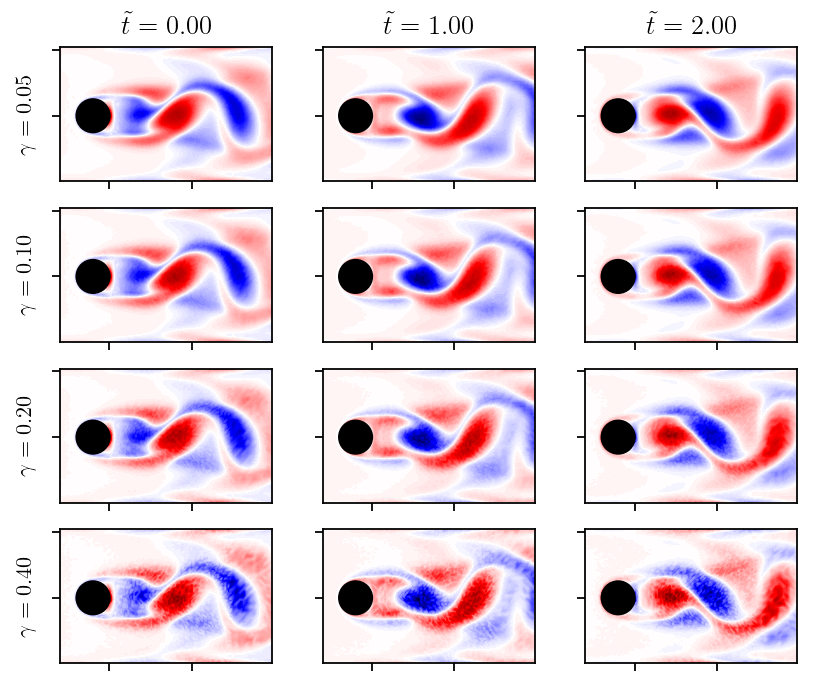
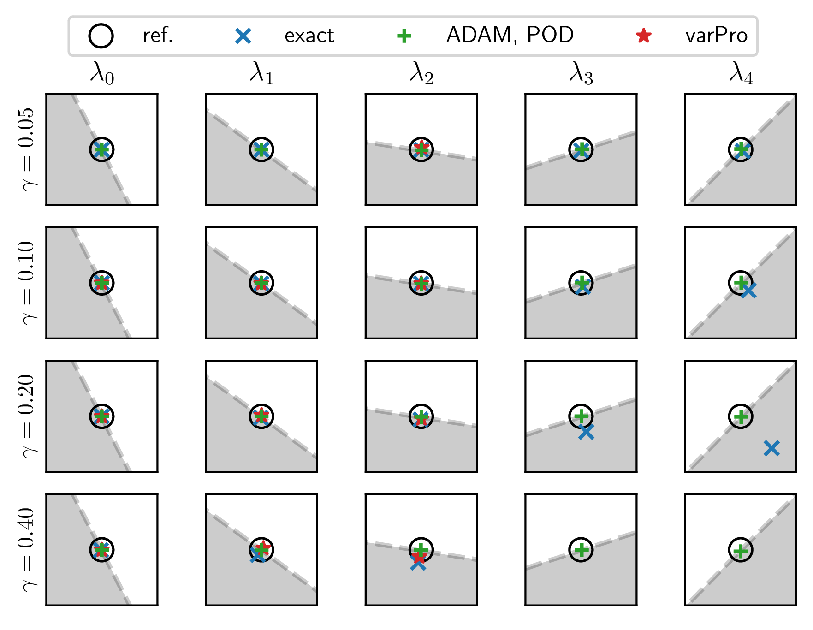

# Backpropagation and gradient descent for an optimized DMD

This code repository accompanies the article [Backpropagation and gradient descent for an optimized DMD](https://arxiv.org/abs/2312.12928). Reference for citations:
```
@misc{weiner2023,
      title={Backpropagation and gradient descent for an optimized dynamic mode decomposition}, 
      author={Andre Weiner and Richard Semaan},
      year={2023},
      eprint={2312.12928},
      archivePrefix={arXiv},
      primaryClass={physics.flu-dyn}
}
```

This research is part of the research unit [FOR 2895](https://www.for2895.uni-stuttgart.de/) on **Unsteady flow and interaction phenomena at High Speed Stall conditions**.
We introduces an alternative strategy to solve the [optimized DMD](https://doi.org/10.1137/M1124176) problem.
The optimization relies on backpropagation and gradient descent.
The approach is very robust to noise, allows incorporating [physical constraints](https://doi.org/10.1098/rspa.2022.0576) or [regularization](https://doi.org/10.1063/1.4863670), and mitigates overfitting by following machine learning best practices.

## Results sneak peek

The figure below shows a sequence of vorticity snapshots taken from the laminar flow past a cylinder. The snapshots are heavily corrupted by noise. The noise is scaled by the absolute value of the vorticity and a scaling factor $\gamma$.



The figure below presents the first five eigenvalues (sorting by mode amplitude) computed with exact DMD, optimized DMD solved by variable projection (varPro), and optimized DMD solved with backpropagation/gradient descent (ADAM/POD). Each box has a width of 0.01. The black reference circles mark the eigenvalues obtained with exact DMD on the clean data. The ADAM/POD approach captures all eigenvalues accurately for the full range of investigated noise levels. 



## Repository structures and dependencies

The new algorithm is tested on three different datasets. Each analysis is contained in a dedicated Jupyter notebook:

- [1d_example.ipynb](https://github.com/AndreWeiner/optDMD/blob/main/1d_example.ipynb): toy problem with known dynamics; corresponds to example 2 in [Askham and Kutz](https://doi.org/10.1137/M1124176)
- [cylinder.ipynb](https://github.com/AndreWeiner/optDMD/blob/main/cylinder.ipynb): laminar flow past a circular cylinder at $Re=100$; classical benchmark case
- [swept_wing.ipynb](https://github.com/AndreWeiner/optDMD/blob/main/swept_wing.ipynb): pressure sensitive paint measurements of transonic shock buffet on a swept wing

The DMD analyses rely on two packages, PyDMD and flowTorch. [PyDMD](https://github.com/PyDMD/PyDMD) implements the optimized DMD based on variable projection. To install PyDMD, run:
```
pip3 install pydmd
```
The new algorithm and the exact DMD are implemented in [flowTorch](https://github.com/FlowModelingControl/flowtorch). Currently, the new algorithm is only available on the development branch. To install the development version, run:
```
pip3 install git+https://github.com/FlowModelingControl/flowtorch.git@aweiner
```

The snapshots of the cylinder flow are part of the flowTorch dataset collection; refer to the [installation instructions](https://github.com/FlowModelingControl/flowtorch#getting-started). The shock buffet data is proprietary and cannot be shared easily. To get access to the data, please contact one of the authors.

In case of doubt, feel free to open an issue in this repository or contact one of the authors.

## Acknowledgement

The authors gratefully acknowledge the Deutsche Forschungsgemeinschaft DFG (German Research Foundation) for funding this work in the framework of the research unit FOR 2895 under the grant WE 6948/1-1. The authors would like to thank the Helmholtz Gemeinschaft HGF (Helmholtz Association), Deutsches Zentrum für Luft- und Raumfahrt DLR (German Aerospace Center) and Airbus for providing the wind tunnel model and financing the wind tunnel measurements as well as public support to mature the test methods applied by DLR and ETW.
